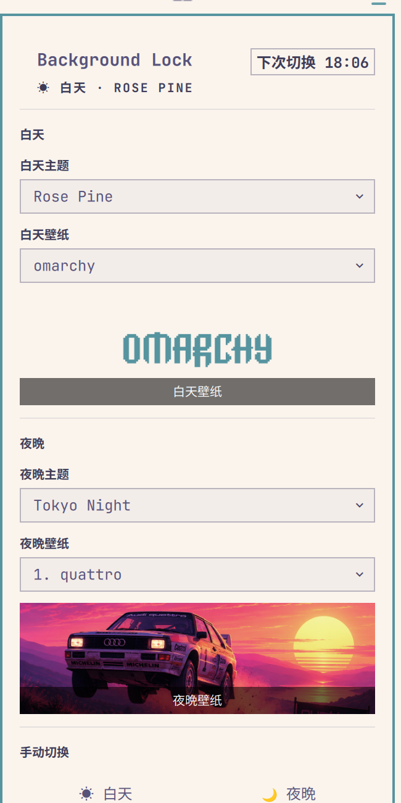

# Background Lock

An [Omarchy](https://omarchy.org) shell plugin that switches your theme and
desktop background on a **sunrise/sunset schedule**, and **locks a chosen
wallpaper to each period** so it survives manual theme switches.



## Features

- ☀️ **Day / 🌙 night periods** driven by real sunrise & sunset times
  (queried from [wttr.in](https://wttr.in), honoring the location configured
  in the Omarchy weather widget).
- **Per-period theme + wallpaper** — pick any installed theme and any of its
  backgrounds for day and for night.
- **Background lock** — if the theme changes through any other path (manual
  `omarchy theme set`, the theme switcher, ...), the period's wallpaper is
  re-applied automatically.
- **Bar pill** showing the active period (sun by day, moon by night); click it
  to open the panel.
- **Panel** with live sunrise/sunset times, theme & wallpaper pickers with
  previews, and manual day/night switching (the schedule takes over again at
  the next boundary).
- **Fully self-contained** — no external helper scripts, no systemd units to
  install. Everything runs inside the shell via QML.

## Install

```bash
omarchy plugin add https://github.com/xiaowei2479-crypto/omarchy-background-lock.git --enable
```

Then place the widget where you like it:

```bash
omarchy bar move xiaowei2479.background-lock --section center
```

## Usage

Click the sun/moon pill in the bar to open the panel:

- **白天 / 夜晚 (Day / Night)** — choose the theme and wallpaper for each
  period. The wallpaper dropdown lists the backgrounds shipped with the
  selected theme plus any in `~/.config/omarchy/backgrounds/<theme>/`.
  Leave it on "（主题默认）" to use the theme's own default background.
- **手动切换 (Manual switch)** — jump to day or night immediately. The
  automatic schedule resumes at the next sunrise/sunset.
- **切换依据 (Schedule)** — the sunrise/sunset times the schedule is based on.

## Configuration

Settings live in `~/.local/state/omarchy/settings/background-lock.json`:

```json
{
  "day_theme": "Rose Pine",
  "night_theme": "Tokyo Night",
  "day_wallpaper": "/path/to/day.png",
  "night_wallpaper": "/path/to/night.png"
}
```

Edit it directly or through the panel — the service watches the file and
re-applies on change.

## How it works

- A singleton **service** reads the config, queries wttr.in for sunrise/sunset,
  and on a one-minute timer computes the active period. When the period flips
  it runs `omarchy theme set <theme>` and `omarchy theme bg set <wallpaper>`.
- A `FileView` watches `current/theme.name`; on an external theme change the
  period wallpaper is re-applied (background lock).
- The bar widget reads a small state file
  (`~/.local/state/omarchy/sun-theme-state.json`) to render the pill and panel.

## Requirements

- Omarchy (Quickshell-based shell)
- `curl` (for the wttr.in query) — already present on Omarchy

## License

[MIT](LICENSE)
